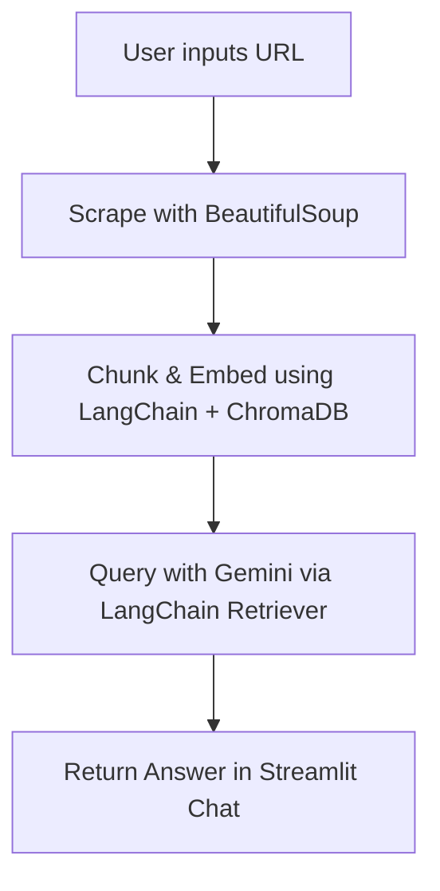

# 💬 WebChat 🌐

**Scrape. Embed. Ask. Get Answers.**

[](https://streamlit.io)
[](https://www.langchain.com/)
[](https://deepmind.google/technologies/gemini/)

---

## 🚀 What is This?

**WebChat** is a powerful and simple tool that lets you *talk to a website*. Just paste a URL, and it'll:

1. 🔍 **Scrape** the content using `BeautifulSoup4`
2. 🧠 **Embed** it into a vector database using `ChromaDB`
3. 🛠️ Use **LangChain** to create a Retrieval-Augmented Generation (RAG) pipeline
4. 🤖 Let you chat with the content using **Gemini 2.0 Flash**

It's like having a conversation with a website. Perfect for:

* 🔎 Researching articles
* 🧾 Summarizing documentation
* 💡 Extracting insights from blogs
* 🗂️ Navigating terms of service, FAQs, etc.

---

## 🧠 Tech Stack

| 🔧 Tool            | 📝 Purpose                   |
| ------------------ | ---------------------------- |
| `LangChain`        | RAG pipeline orchestration   |
| `Streamlit`        | Interactive web UI           |
| `BeautifulSoup4`   | HTML scraping and cleaning   |
| `ChromaDB`         | Fast and simple vector store |
| `Gemini 2.0 Flash` | Lightning-fast LLM for QA    |

---

## 🖥️ Demo

Paste a URL, wait for the magic, then start chatting!
Try it out locally below ⬇️

---

## 📦 Installation

```bash
git clone https://github.com/mohamed-abdelnaser4/WebChat
cd WebChat
pip install -r requirements.txt
streamlit run app.py
```

---

## 🛠️ Usage

1. Open the app
2. Enter any valid URL
3. Wait while it scrapes and embeds the content
4. Ask anything! 💬

---

## 🔐 Environment Variables

Make sure to set your API key before running the app:

Use a `.env` file:

```env
GOOGLE_API_KEY=your_api_key_here
```

---

## 📚 How It Works



---

## 🧪 Example URLs to Try

* [https://en.wikipedia.org/wiki/Artificial\_intelligence](https://en.wikipedia.org/wiki/Artificial_intelligence)
* [https://docs.streamlit.io](https://docs.streamlit.io)
* [https://openai.com/research](https://openai.com/research)

---

Happy chatting! 💬🌐✨
